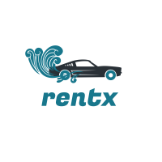

<div id="top"></div>


<div align="center">

[![Forks][forks-shield]][forks-url]
[![Stargazers][stars-shield]][stars-url]
[![Issues][issues-shield]][issues-url]
[![Licence][licence-shield]][licence-url]
[![LinkedIn][linkedin-shield]][linkedin-url]
    
</div>


<!-- PROJECT LOGO -->
<br />
<div align="center">
  <a href="https://github.com/denis2710/rentex">
    
  </a>

  <h3 align="center">Rentx</h3>

  <p align="center">
    A project of a rent car. Made just to pratice Typescript and NodeJs 
    <br />
    <a href="https://github.com/denis2710/rentex"><strong>Explore the docs »</strong></a>
    <br />
    <br />
    <a href="https://github.com/denis2710/rentex">View Demo (commming soon)</a>
    ·
    <a href="https://github.com/denis2710/rentex/issues">Report Bug</a>
    ·
    <a href="https://github.com/denis2710/rentex/issues">Request Feature</a>
  </p>
</div>


<!-- TABLE OF CONTENTS -->
<details>
  <summary>Table of Contents</summary>
  <ol>
    <li>
      <a href="#about-the-project">About The Project</a>
      <ul>
        <li><a href="#built-with">Built With</a></li>
      </ul>
    </li>
    <li>
      <a href="#getting-started">Getting Started</a>
      <ul>
        <li><a href="#prerequisites">Prerequisites</a></li>
        <li><a href="#installation">Installation</a></li>
      </ul>
    </li>
    <li><a href="#usage">Usage</a></li>
    <li><a href="#roadmap">Roadmap</a></li>
    <li><a href="#contributing">Contributing</a></li>
    <li><a href="#license">License</a></li>
    <li><a href="#contact">Contact</a></li>
    <li><a href="#acknowledgments">Acknowledgments</a></li>
  </ol>
</details>


<!-- ABOUT THE PROJECT -->
## About The Project

This is a project made with Typescript and NodeJs. I make this project following the RocketSeat Ignite Courese. The proposal is to use all tecnology necessary to delivery a API to a rent car interprize. 

<p align="right">(<a href="#top">back to top</a>)</p>


### Built With

* [Node.js](https://nodejs.org/)
* [Express.js](https://expressjs.com/pt-br/)
* [Typescript](https://www.typescriptlang.org/)
* [TypeOrm](https://typeorm.io/)
* [Docker](https://www.docker.com/)
* [Postgres](https://www.postgresql.org/)

<p align="right">(<a href="#top">back to top</a>)</p>


<!-- GETTING STARTED -->
## Getting Started

Here are the instructions to you run the project in your computer.

### Prerequisites

You should have [Docker](https://docs.docker.com/get-docker/) installed in your computter to run this project.  


* in terminal you just need to run the following command
  ```sh
  docker-compose up
  ```

<p align="right">(<a href="#top">back to top</a>)</p>


<!-- USAGE EXAMPLES -->
## Usage

This is a non authenticated api, so you just have to use a software like [Postman](https://www.postman.com/) or [Insomnia](https://insomnia.rest/download) to do the requests 

_For more examples, please refer to the [Documentation (comming soon)](https://example.com)_

<p align="right">(<a href="#top">back to top</a>)</p>


<!-- ROADMAP -->
## Roadmap

- [x] Add Readme to project 
- [x] Create basics structures 
- [x] Create base Models  
- [x] Create base UseCases 
- [X] Add a Database
- [X] Add a ORM System
- [X] Refactor using a dependency injection system 
- [ ] Create all the user system 
  - [ ] Create models and UseCase 

See the [open issues](https://github.com/denis2710/rentex/issues) for a full list of proposed features (and known issues).

<p align="right">(<a href="#top">back to top</a>)</p>


<!-- CONTRIBUTING -->
## Contributing

If you have a suggestion that would make this better, please fork the repo and create a pull request. You can also simply open an issue with the tag "enhancement".
Don't forget to give the project a star! Thanks again!

1. Fork the Project
2. Create your Feature Branch (`git checkout -b feature/AmazingFeature`)
3. Commit your Changes (`git commit -m 'Add some AmazingFeature'`)
4. Push to the Branch (`git push origin feature/AmazingFeature`)
5. Open a Pull Request

<p align="right">(<a href="#top">back to top</a>)</p>


<!-- LICENSE -->
## License

Distributed under the MIT License. See `LICENSE.txt` for more information.

<p align="right">(<a href="#top">back to top</a>)</p>


<!-- CONTACT -->
## Contact

Denis Alves - [@3denis](https://twitter.com/3denis) - denispereiraalves@gmail.com

Project Link: [https://github.com/denis2710/rentex](https://github.com/denis2710/rentex)

<p align="right">(<a href="#top">back to top</a>)</p>


<!-- MARKDOWN LINKS & IMAGES -->
<!-- https://www.markdownguide.org/basic-syntax/#reference-style-links -->

[forks-shield]: https://img.shields.io/github/forks/denis2710/rentex
[forks-url]: https://github.com/denis2710/rentex/network/members
[stars-shield]: https://img.shields.io/github/stars/denis2710/rentex
[stars-url]: https://github.com/denis2710/rentex/stargazers
[licence-shield]: https://img.shields.io/github/license/denis2710/rentex
[licence-url]: https://github.com/denis2710/rentex/blob/master/LICENSE.txt
[issues-shield]: https://img.shields.io/github/issues/denis2710/rentex
[issues-url]: https://github.com/denis2710/rentex/issues

[linkedin-shield]: https://img.shields.io/badge/-LinkedIn-black.svg?style=plastic&logo=appveyor&logo=linkedin&colorB=555
[linkedin-url]: https://www.linkedin.com/in/denis-alves/
[product-screenshot]: images/screenshot.png
